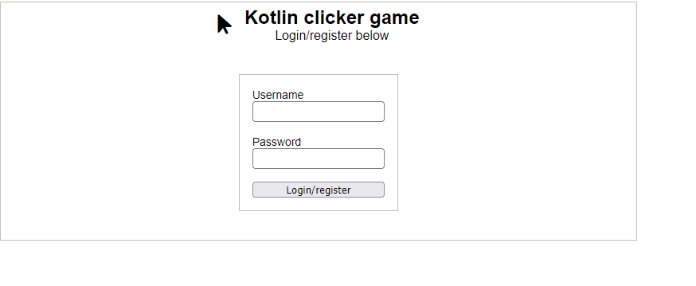
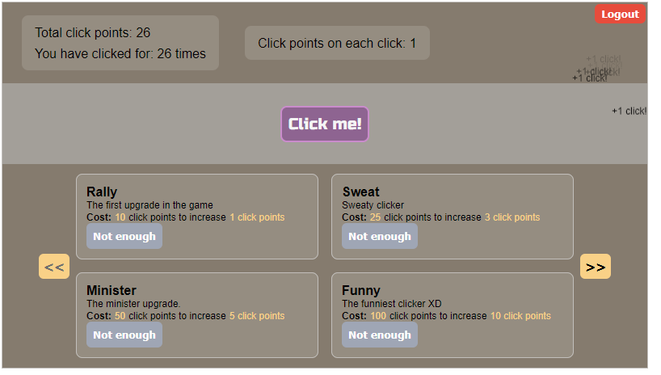

# Kotlin Clicker

Simple clicker game to demonstrate server-sided website rendering in Kotlin. Game is not really completed but already grasped basic SSR concepts.




Features:
- hot reload update (no refresh) on each click to status and shop
- session based (cookie) authentication that will guard game page and other API request without a valid session (require login).

Uses:
- Kotlin Ktor
- HTML DSL + CSS DSL
- HTMX

Evaluation:
- HTML DSL + CSS DSL reduces coding speed
  - (-) Each update needs to reload server and refresh page (require rebuilding the server and we don't have hot module plugin)
  - (+) HTML DSL enables component-based layouting (like Compose or React)
  - (-) Changing between file (i.e., between the component file and CSS styles) is annoying;
  - Kotlinwind is a nice library, though its not outdated and can't be used RN.
- SSR okay because full Kotlin, HTMX helps alot, but Javascript is still significant.
  - (+) treat UI "components as route" where each widget require fetching certain endpoint; and instead of returning JSON from that endpoint, we return HTML. This is common pattern and very flexible because each update on UI could just re-fetch an endpoint via HTMX trigger. 
  - (-) Javascript is needed for client-sided action (e.g., UI state), and the wiring between HTML DSL code with Javascript is not crystal clear. Without JavaScript and HTMX knowledge, you will definitely struggle.
- Package separated to `web/` and `server/`
  - the web package (in this project named as `ui`) contains `Head.kt` (head definition), `Styles.kt` (CSS theme, color constants and definition).
  - `pages/` subpackage contains more subpackage of each webpage (e.g., package play for route /play, package home for index route).
  - Better separation between UI and server code is needed. Should combine API routes that return HTML in the web/ package and not in server/. Although there are server logic within the API routes that returns HTML, there are still some UI declaration. Better yet, create class or functions that facade the server logic and let the UI just call it.
  - more ideal package aiming for modularity:
    ```
    web/
        Head.kt (HTML head definition)
        Theme.kt (site theme constants)
        Styles.kt (use Theme.kt to declare CSS rules)
        components/ (globally common component)
                   Button.kt
                   TextField.kt
        pages/
              home/
                   HomePage.kt
                   sections/ (sections of a page)
                            Login.kt
                            Register.kt
                            ForgotPassword.kt
                            About.kt
                            News.kt
                            Contact.kt
                   components/ (smaller components within a page)
                              AuthDialog.kt
                              HomeSection.kt
              play/
                   PlayPage.kt
                   ...
                   ...
              ...
              ...
    ```
    This separates UI based on features, which is ideal for larger site.